# MINGGU 01 - INSTALASI GIT (WINDOWS)
##1. Download master git for windows
	- Download master installer git for windows di link berikut [https://git-scm.com/download/win](https://git-scm.com/download/win)

##2. Jalankan installer dengan men-double-click pada exe master yang sudah didownload
	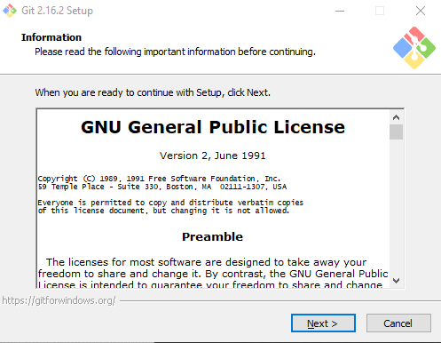

##3. Klik Next lalu pilih direktori instalasi
	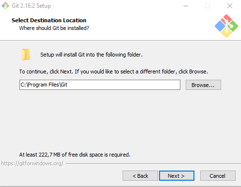

##4. Klik Next lalu pilih plugin yang dibutuhkan
	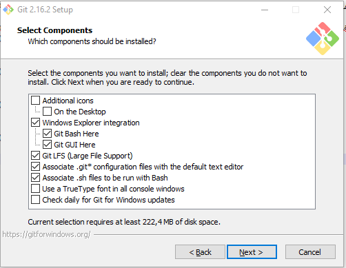
	
##5. Klik Next lalu ketikan nama folder untuk start menu Git
	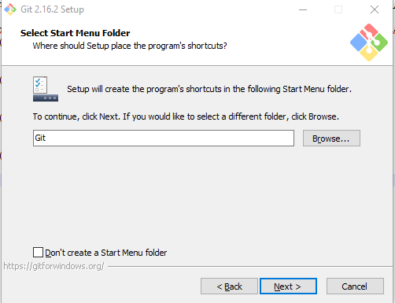

##6. Klik Next lalu pilih text editor yang digunakan untuk git
	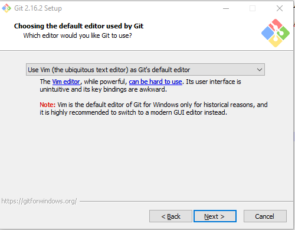
	
##7. Klik Next lalu pilih metode penggunaan git pada sistem operasi windows
	
	- Pilih poin nomer satu jika ingin menggunakan git via GitBash
	- Pilih poin nomer dua untuk menggunakan git melalui command prompt windows
	- Pilih poin ketiga untuk mengimport semua tool git ke command prompt windows
	
##8. Klik Next lalu pilih HTTPS Transport backend yang ingin digunakan
	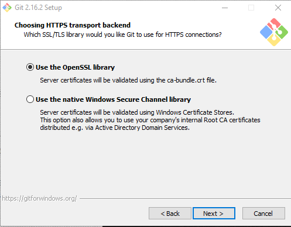
	- HTTPS Transport Backend adalah metode yang digunakan untuk komunikasi git dengan server repositori yang menggunakan HTTPS
	- Pilih poin pertama jika ingin menggunakan bawaan dari installer git for windows\
	- Pilih poin kedua jika ingin menggunakan bawaan dari sistem operasi windows

##9. Klik Next lalu pilih metode Line Ending Conversion
	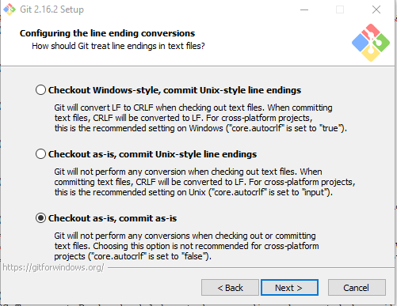
	
##10. Klik Next lalu pilih software emulator untuk gitBash
	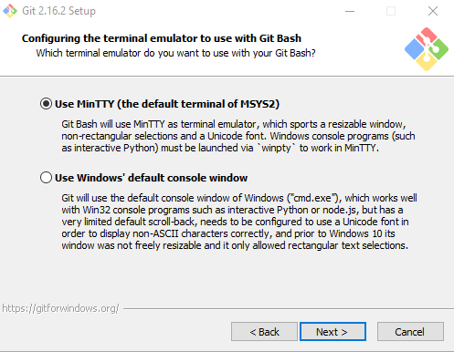

##11. Klik Next lalu pilih fitur ekstra untuk dikonfigurasi ke git
	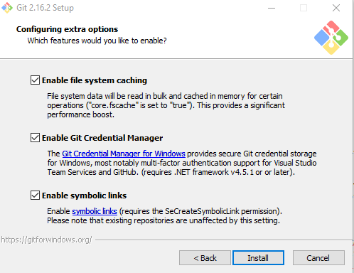
	- Lalu klik Install
	
##12. Proses instalasi
	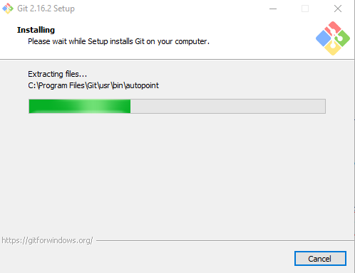
	
##13. Instalasi selesai
	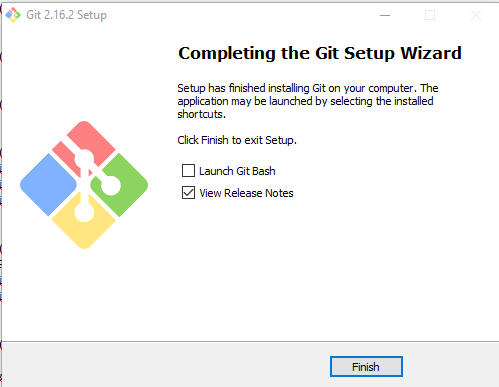
	
