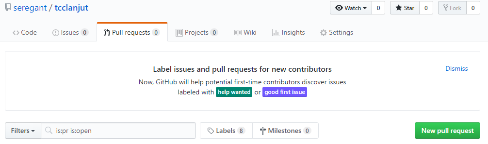
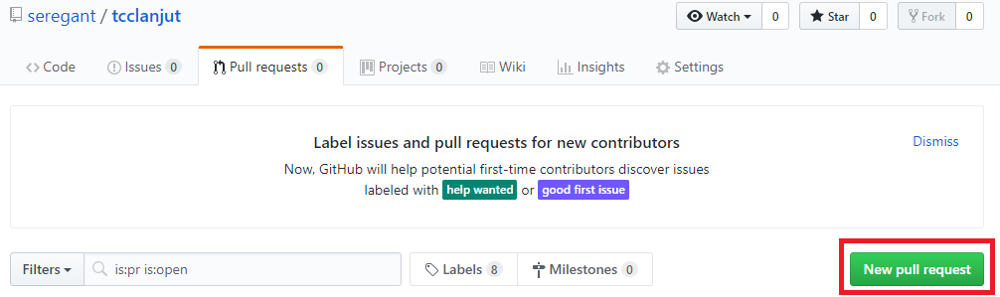
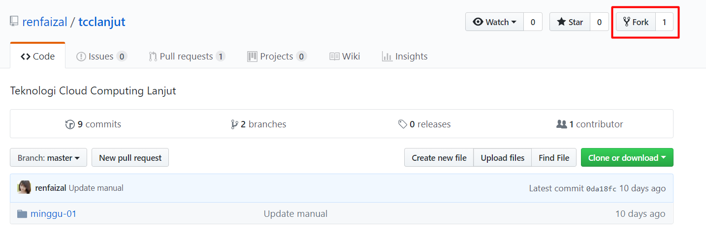
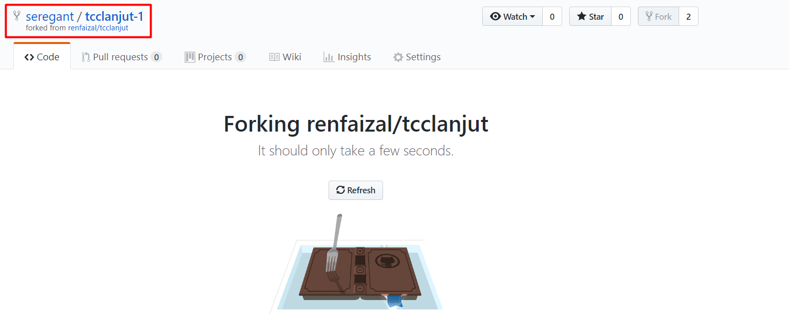
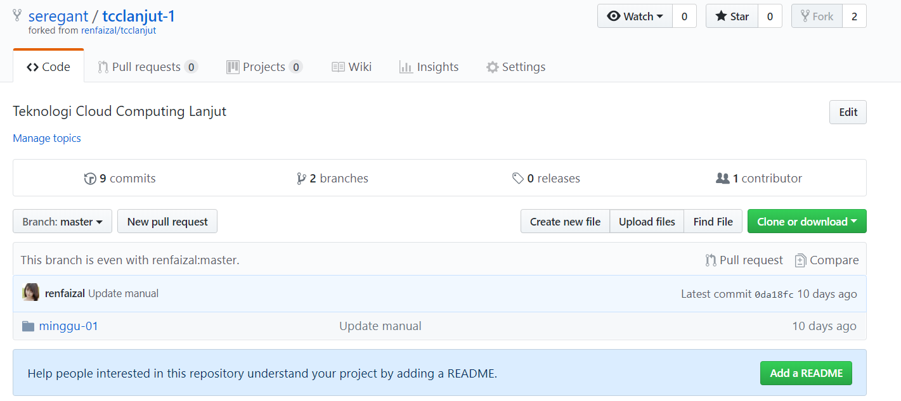
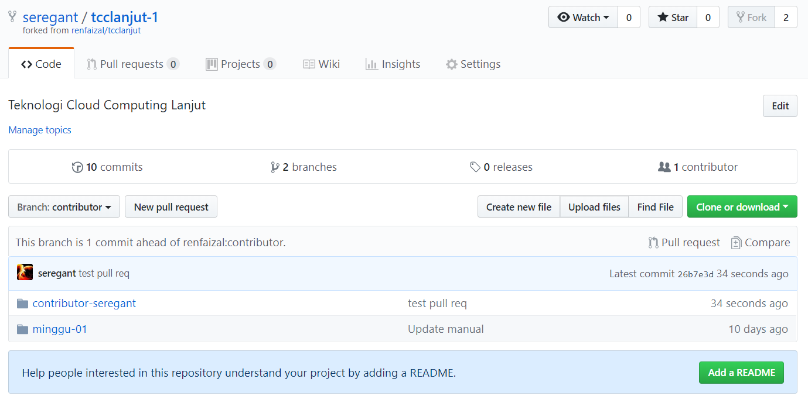
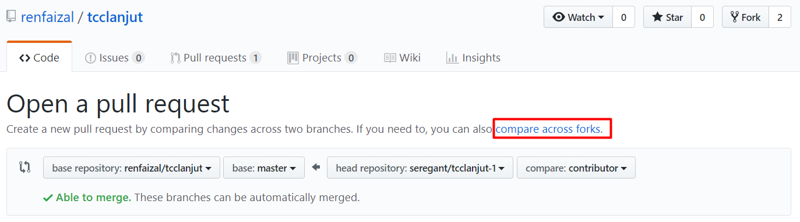

## MINGGU 02 - Menggunakan fitur pull request

1. Setelah login ke GitHub pilih repositori lalu masuk ke menu tab **Pull requests**
	
	
	
2. Klik button **New pull request**
	
	
	
3. Jika belum ada fork atau branch lain yang berbeda dengan master, maka kita tidak bisa melakukan pull request dan akan diinstruksikan untuk membuat branch baru agar dapat dibandingkan dengan master. Kita bisa membuat branch dari repo tersebut menjadi repo di akun kita dengan menggunakan fitur fork
	
	Disini saya menggunakan repo dari [https://github.com/renfaizal/tcclanjut](Reno Faizal) 

	

	Klik icon fork tersebut maka akan dibuat sebuah repo baru di akun kita dengan menduplikasi dari repo yang kita fork.

	

	Pada gambar di atas dapat kita lihat setelah menlakukan klik ke icon fork kita akan dialihkan ke akun kita sendiri ke repo hasil duplikasi dari repo yang kita fork, sehingga kita memiliki repo yang sama persis dengan repo dimana kita ingin berkontribusi di repo tersebut. Di repo baru ini kita bebas melakukan perubahan karena repo ini milik kita sendiri.

	Berikut adalah hasil dari proses duplikasi dengan fork yang sudah selesai

	
	
4. Setelah melakukan perubahan di repo fork kita, untuk melakukan merge ke repo asli kita perlu melakukan pull request.

	Berikut adalah perubahan yang saya lakukan di repo saya sendiri

	

	