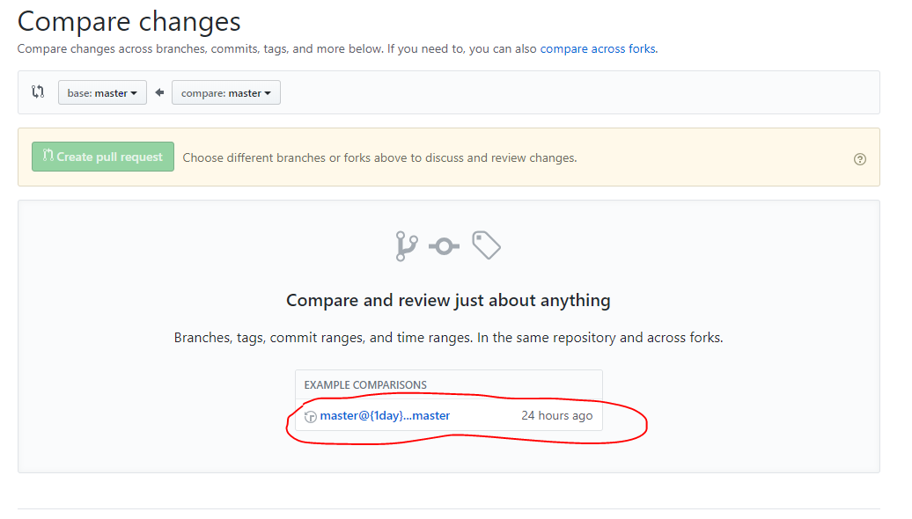

## MINGGU 02 - Menggunakan fitur pull request

1. Setelah login ke GitHub pilih repositori lalu masuk ke menu tab **Pull requests**
	
	
	
2. Klik button **New pull request**
	
	
	
3. Jika belum ada fork atau branch lain selain master maka kita tidak bisa melakukan pull request dan akan diinstruksikan untuk membuat branch baru agar dapat dibandingkan dengan master
	
	
	
4. Jika branch baru sudah dibuat maka kita bisa memilik branch mana yang akan kita pull lalu kita bisa menuliskan temuan atau ide kita terhadap code yang ingin kita ubah

	