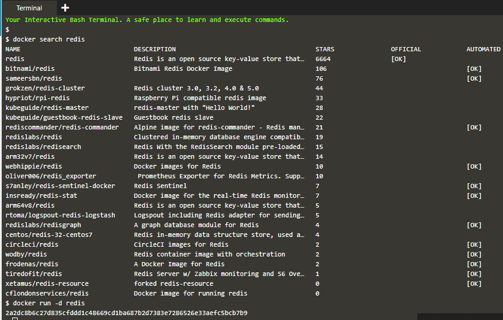
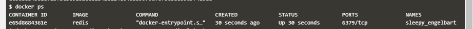
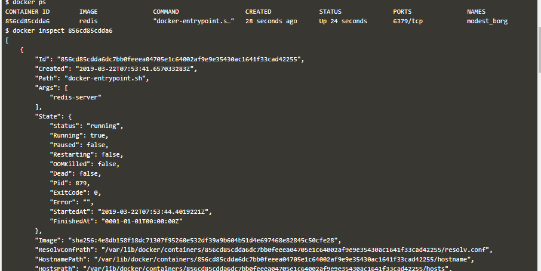

### Docker Container

Docker merupakan sebuah program komputer yang dapat melakukan virtualisasi di level sistem operasi yang unit virtualisasinya disebut sebagai container. Container merupakan teknik efisiensi dari virtualisasi dengan konsep virtual machine (VM) . 
VM akan mem-virtualisasikan hardware komputer di atas hypervisor sehingga hardware suatu mesin komputer dibagi ke beberapa VM yang dibuat. Berbeda dengan VM, container mengabstraksikan sebuah aplikasi ke dalam satu paket yang berisi kode aplikasi dan perangkat lunak-perangkat lunak pendukung aplikasi tersebut agar aplikasi dapat berjalan, paket tersebut disebut image. Image akan dijalankan diatas service Docker yang berjalan diatas sebuah sistem operasi. Beberapa container dengan program dan dependensi yang berbeda – beda dapat berjalan bersamaan dengan saling berbagi resource kernel dari sistem operasi yang menjalankan service Docker. 

1. Membuat Image

    Docker image dibuat dengan menggunakan base image yang tersedia di repsitory docker-hub. Image yang tersedia dapat dicari dengan menggunakan command `docker search` seperti berikut.

    

    Untuk menjalankan container dengan menggunakan image yang sudah tersedia jalankan dengan menggunakan command `docker run`.

    

    - Flag `-d` digunakan agar container berjalan dalam mode daemon
    - Flag `--name` digunakan untuk memberi nama container
    - Flag `-p` digunakan untuk men-expose container port
    - Parameter `redis:latest` adalah nama image yang akan dijalankan dalam container

    Untuk melihat cotntainer yang sedang berjalan menggunakan command `dokcer ps`.

    

    Untuk melihat detail konfigurasi container gunakan command `docker inspect`.

    