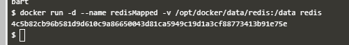
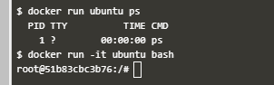
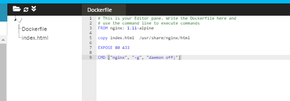
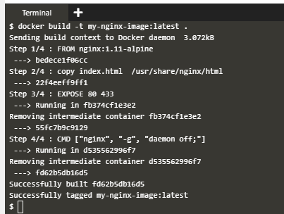
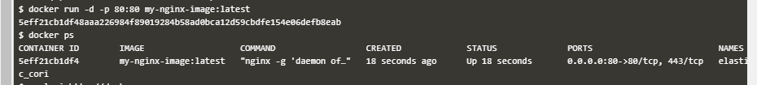
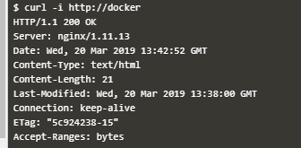

### Docker Container

Docker merupakan sebuah program komputer yang dapat melakukan virtualisasi di level sistem operasi yang unit virtualisasinya disebut sebagai container. Container merupakan teknik efisiensi dari virtualisasi dengan konsep virtual machine (VM) . 
VM akan mem-virtualisasikan hardware komputer di atas hypervisor sehingga hardware suatu mesin komputer dibagi ke beberapa VM yang dibuat. Berbeda dengan VM, container mengabstraksikan sebuah aplikasi ke dalam satu paket yang berisi kode aplikasi dan perangkat lunak-perangkat lunak pendukung aplikasi tersebut agar aplikasi dapat berjalan, paket tersebut disebut image. Image akan dijalankan diatas service Docker yang berjalan diatas sebuah sistem operasi. Beberapa container dengan program dan dependensi yang berbeda – beda dapat berjalan bersamaan dengan saling berbagi resource kernel dari sistem operasi yang menjalankan service Docker. 

1. Membuat Image dan Container

    Docker image dibuat dengan menggunakan base image yang tersedia di repsitory docker-hub. Image yang tersedia dapat dicari dengan menggunakan command `docker search` seperti berikut.

    

    Untuk menjalankan container dengan menggunakan image yang sudah tersedia jalankan dengan menggunakan command `docker run`.

    

    - Flag `-d` digunakan agar container berjalan dalam mode daemon
    - Flag `--name` digunakan untuk memberi nama container
    - Flag `-p` digunakan untuk men-expose container port
    - Parameter `redis:latest` adalah nama image yang akan dijalankan dalam container

    Untuk melihat cotntainer yang sedang berjalan menggunakan command `dokcer ps`.

    

    Untuk melihat detail konfigurasi container gunakan command `docker inspect`.

    

2. Container Volume

    Agar data hasil pemrosesan dalam container dapat disimpan secara permanen perlu dibuat container volume yang di-mount ke dalam container. Volume dapat berupa direktori dari docker host.

    Untuk membuat container yang memiliki volume tambahkan flag `-v` pada command `docker run` seperti berikut.

    

    Flag `-v` diikuti dengan konfigurasi mount data dalam kontainer dan direktori volume pada docker host. Pada contoh diatas folder `/opt/docker/data` pada docker host di-mount dalam container pada folder `/data`.

3. Masuk ke dalam container

    Untuk mengakses console dalam container pada command `docker run` diikuti dengan command yang ingin kita eksekusi atau menambahkan flag `-it`.

    

    Perbedaan pada penggunaan flag `-it` adalah kita akan mendapatkan full akses ke console dalam container. Command consolse selanjutnya setelah kita mengeksekusi command `docker run -it ubuntu bash` pada contoh di atas adalah command yang akan diterima oleh container dengan image ubuntu.

4. Dockerfile

    Dockerfile adalah script yang digunakan untuk membuat sebuah image.

    

    - Pada contoh di atas Dockerfile berisi script `FROM` untuk mendeklarasikan base image yang digunakan. 
    - Script `COPY` untuk menyalin file dan folder yang terletak di direktori yang sama dengan Dockerfile ke dalam image container yang akan dibuat. 
    - Script `EXPOSE` digunakan untuk menmbuka akses network container pada port tertentu.
    - Script `CMD` untuk mendeklarasikan command apa yang akan djalankan saat container dibuat.

    Setelah file Dockerfile disimpan build immage dilakukan dengan menggunakan command `docker build` seperti berikut.

    

    Flag `-t` pada contoh di atas digunakan untuk memberi tag pada image yang akan dibuat dan di akhir command harus di deklarasikan dimana letak Dockerfile berada. Pada contoh di atas letak Dockerfile berada di current directory sehingga ditulis dengan tanda titik.

    Untuk melihat daftar image yang tersedia dalam komputer yang digunakan dilakukan dengan menggunakan command `docker images`.

    

    Test image dengan menjalankannya dengan meng-expose port container sesuai dengan port yang didefinisikan dalam script `EXPOSE` pada Dockerfile.

    

    Test aplikasi dengan mengakses docker host pada port yang digunakan untuk expose service

    