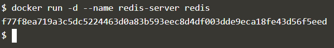
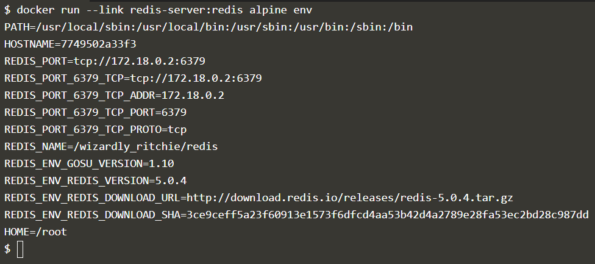
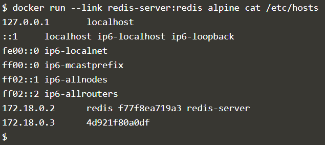
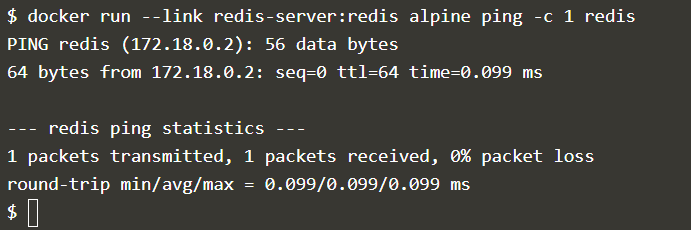

## MINGGU 04 - Docker Networking

Agar dua container dapat saling terhubung maka diperlukan media. Pada Docker media untuk komunikasi antar container dapat menggunakan network atau link.

### Network
Dengan menggunakan platform Katacoda, berikut adalah langkah - langkah yang dijelaskan pada course "Communicating between containers".

1. Jalankan container

    Pada contoh yang digunakan image yang dijalankan adalah image dari redis-server.

    

    Gunakan flag -d agar container berjalan di background sehingga kita dapat menjalankan perintah-perintah lain di console.

2. Membuat Link

    Link adalah fitur dari Docker yang digunakan untuk menyesuaikan environment variable dari kontainer yang ingin di-link dengan container yang akan dibuat. Pada contoh berikut container redis yang dibuat sebelumnya akan di hubungkan dengan container dengan image sistem operasi alpine dengan menggunakan link.

    

    Dapat kita lihat command di atas digunakan untuk memberikan output nilai-nilai dari environment variable yang digenerate oleh fitur link dari docker agar container dengan image alpine dapat berkomunikasi langsung dengan container redis.

    

    Command di atas juga bertujuan untuk melakukan pengecekan terhadap kesesuaian konfigurasi pada container alpine agar container tersebut dapat berkomunikasi dengan container redis.

    Dapat kita lihat output di atas adalah isi file /etc/hosts dari container alpine. Pada output tersebut ip dari container redis sudah dikonfigurasi agar dapat diakses menggunakan domain name "redis" untuk membuktikannya kita coba jalankan command ping pada container alpinde dengan melakukan link ke container redis seperti berikut.

    
