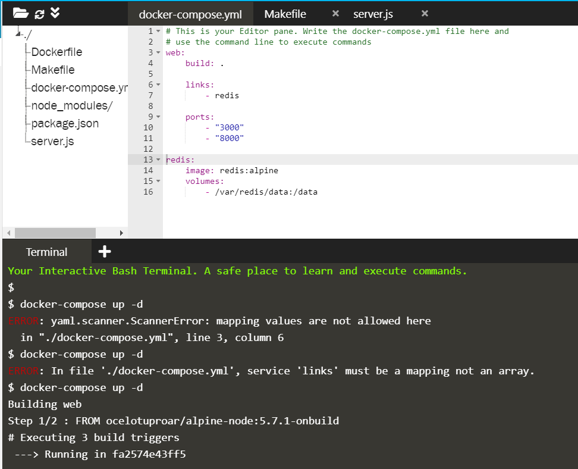

## DOCKER COMPOSE

1. Mendefinisikan file konfigurasi docker-compose.yaml untuk konfigurasi docker swarm

    

    Pada docker file docker-compose.yaml untuk konfigurasi docker swarm kita dapat mendefinisikan konfigurasi deployment. Pada contoh di atas deploymet yang akan dilakukan akan dibuat dua container dengan nama `web` dan `redis` dimana pada definisi build nya terdapat dua container. Container pertama diberi nama `web` dimana image untuk container web didapatkan dari build pada direktori yang satu level dengan docker-compose.yaml dan menjalankan container `redis` yang dibangun dengan menggunakan image `redis:alpine` yang dikonfigurasi menggunakan volume pada hostpath `/data` yang di-mount dalam container `redis` dalam folder `/var/redis/data`.

    Selanjutnya untuk melakukan deployment jalankan dengan menggunakan command `docker-compose up -d` dalam folder file docker-compose.yaml maka akan dilakukan build image dan menjalankan container sesuai dengan konfigurasi.