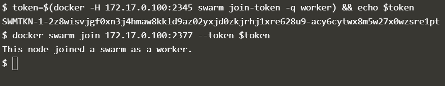
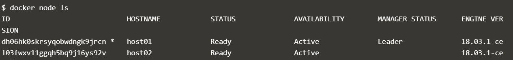
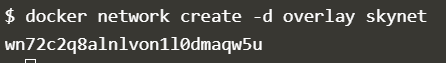
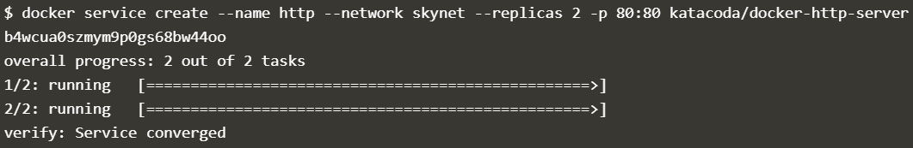

## DOCKER COMPOSE

1. Mendefinisikan file konfigurasi docker-compose.yaml untuk konfigurasi docker swarm

    Pada docker file docker-compose.yaml untuk konfigurasi docker swarm kita dapat mendefinisikan konfigurasi deployment. Pada contoh di atas deploymet yang akan dilakukan akan dibuat dua container dengan nama `web` dan `redis` dimana pada definisi build nya terdapat dua container. 
    
    

    Container pertama diberi nama `web` dimana image untuk container web didapatkan dari build pada direktori yang satu level dengan docker-compose.yaml dan menjalankan container `redis` yang dibangun dengan menggunakan image `redis:alpine` yang dikonfigurasi menggunakan volume pada hostpath `/data` yang di-mount dalam container `redis` dalam folder `/var/redis/data`.

    Selanjutnya untuk melakukan deployment jalankan dengan menggunakan command `docker-compose up -d` dalam folder file docker-compose.yaml maka akan dilakukan build image dan menjalankan container sesuai dengan konfigurasi.

2. Pengecekan Deployment

    Pengecekan deployment dapat kita lakukan dengan menggunakan command `docker-compose ps` dengan output command seperti berikut.

    

    Pada output tersebut kita bisa melihat status dari setiap container yang dijalankan dengan docker-compose.

3. Scaling Docker Swarm

    Scaling adalah kegiatan untuk membuat atau mengurangi replika dari deployment dengan tujuan untuk menambah compute resource dari deployment yang telah dibuat. Pada proses scaling container aplikasi akan disesuaikan berdasarkan parameter nama container dan jumlahnya dalam command `docker-compose scale`. Berikut contohnya.

    

    Pada command tersebut parameter `web=3` bertujuan untuk mengubah container `web` yang awalnya berjumlah 1 container menjadi 3 container. 

    

    Pada command tersebut parameter `web=1` bertujuan untuk mengubah container `web` yang berjumlah 3 container menjadi 1 container.

4. Menghentikan Running Deployment

    Untuk menghentikan container-container yang dijalankan melalui docker-compose gunakan command `docker-compose stop` dan untuk menghapus container yang telah dibuat menggunakan command `docker-compose rm`. Kedua command tersebut harus dilakukan pada direktori tempat file docker-compose.yaml berada.

    

## Docker Swarm

Docker Swarm adalah tool yang digunakan sebagai container orchestration. Dengan menggunakan Docker Swarm kita dapat melakukan konfigurasi container cluster yang terdiri dari banyak container dengan beragam fungsi dan tujuan yang saling berhubungan  dengan konfigurasi yang terpusat.

1. Membuat container cluster

    Untuk membuat container cluster gunakan command `docker swarm init`.

    

    Untuk menambahkan server menjadi anggota cluster menggunakan command `docker swarm join`

    

    Command `docker swarm join` diikuti dengan parameter `--token` dimana nilai dari parameter tersebut adalah token autentikasi untuk dapat menjadi anggota dari cluster yang telah dibuat dengan menggunakan `docker swarm init`.

    Untuk melihat daftar server yang menjadi anggota clluster (node) menggunakan command `docker node ls`.

    

    Pada kolom `MANAGER STATUS` value `Leader` menandakan bahwa host tersebut adalah host yang digunakan untuk mengkonfigurasi cluster.

2. Konfigurasi cluster network

    Untuk berkomunikasi antara container satu dengan yang lain perlu dibuat network service dalam cluster. Untuk membuatnya gunakan command `docker network create -d overlay skynet`.

    

    Setelah cluster network dikonfigurasi kita dapat membuat service agar aplikasi yang berjalan di dalam cluster dapat saling berkomunikasi dan diakses. Untuk membuat service dapat dilakukan dengan command seperti berikut.

    

    Untuk melihat daftar service yang sudah dibuat dapat menggunakan command `docker service ls`.

    

    
    