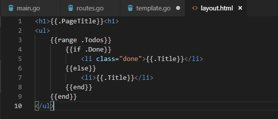

### Go HTTP Server

1. Membuat HTTP Server dengan menggunakan library __net/http__

    Package __net/http__ adalah package bawaan dari go yang digunakan untuk menjalankan web server sehingga program dapat menjalankan web server dan menerima serta merspon request http.

    

    Contoh script di atas adalah contoh penggunaan library __net/http__. Request untuk setiap route yang diterima pada library __net/http__ menggunakan funsi ```HandleFunc()``` dengan dua parameter. Prameter pertama adalah route dari request dan parameter kedua adalah fungsi yang digunakan untuk melakukan response ke requet route tersebut.

    Pada contoh tersebut web server dijalankan pada port 8080 sesuai dengan konfigurasi yang dilakukan melalui fungsi ```ListenAndServe()```

    Untuk menjalankan program masuk ke direktori script main.go lalu jalankan perintah ```go run main.go```. Lalu untuk testing akses menggunakan browser pada localhost:8080.

    

    Dapat kita liat pada output browser, respon yang didapatkan untuk route " / " pada aplikasi adalah tampilan yang sesuai dengan kode yang dijalankan pada fungsi yang dimasukan ke parameter ke dua ```HandleFunc()```.

2. Menggunakan framework __mux__

    Banyak framework pada bahasa pemrograman go untuk membuat backend service. Salah satunya adalah __mux__. Untuk menggunakan mux terlebih dahulu download packagenya dengan perintah ```go get -u github.com/gorilla/mux```.

    Jika tidak ada error terjadi maka package library mux akan didownload dan tersimpan dalam folder ${GOPATH}/src seperti berikut.

    

    Berikut adalah contoh penggunaan __mux__ :

    

    Dapat dilihat pada kode di atas, untuk mengimport library di luar dari library bawaan golang, kita harus menuliskan path folder library secara lengkap pada direktori ${GOPATH}/src dimana library disimpan.

    Pada framework __mux__ dalam request rout dapat dibuat variabel dengan menambahkan tanda ```{}``` . Dalam contoh di atas pada parameter request route terdapat dua variabel yaitu ```title``` dan ```page``` dimana nilai yang ada pada variabel ini dapat diambil dengan menggunakan fungsi `Vars()` yang disediakan dalam libarary __mux__.

    Berikut adalah hasil output dari program tersebut :

    

    Dalam output tersebut dapat kita lihat nilai dari variabel title adalah `Nama Buku` dan nilai dari variabel page adalah `100`.

3. HTML Template

    Dalam bahasa pemrograman go http server dapat melakukan response halaman web dengan menggunakan library __html/template__ yang merupakan bawaan dari default package go.

    

    Pada code di atas, template html diambil dari file __layout.html__ yang dibaca menggunakan `fungsi ParseFiles()` lalu hasil dari pembacaan dijadikan parameter pada fungsi `Must()` untuk memasukan template ke dalam memory program. Selanjuta nya variabel - variabel dalam template di isi data melalui fungsi response http dan di kirimkan ke browser client menggunakan fungsi `Execute()`.

    Untuk isi file dari __layout.html__ adalah sebagai berikut :

    

    Dalam dile html tersebut disisipkan code - code bahasa go dengan tanda pemisah `{{}}`, dua kali kurung kurawal. Pada saat main program di jalankan code go pada template akan membaca variabel yang dimasukkan dan output programnya akan dituliskan sesuai dengan posisi code pada file template seperti berikut.

    