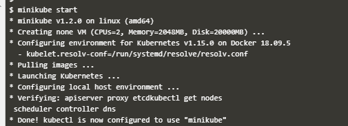
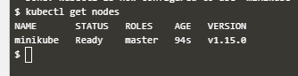
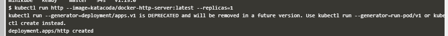
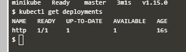
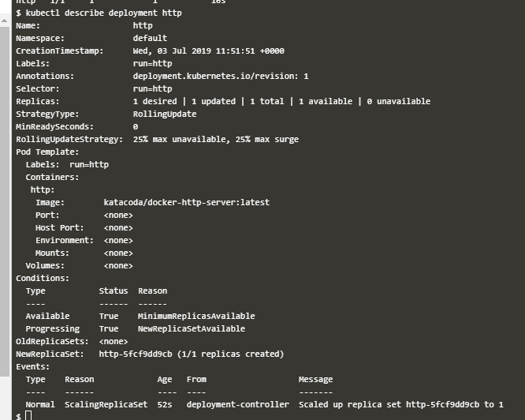
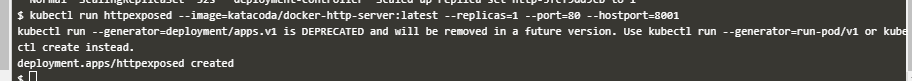
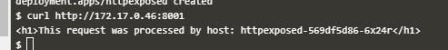
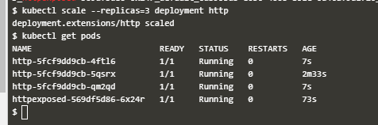
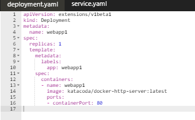

## KUBERNETES

Kubernetes adalah teknologi container orchestration. Dengan Kubernetes dapat dilakukan manajemen banyak container untuk membangun sebuah sistem tertentu.

1. Minikube
    Minkube adalah aplikasi untuk menjalankan cluster Kubernetes sederhana pada local computer. Cara menginisiasi cluster menggunakan minikube adalah sebagai berikut.

    

    Command `minikube start` akan menjalankan aplikasi minikube untuk menjalankan container yang menggunakan dependensi image sistem Kubernetes.

    Untuk memastikan apakah cluster sudah berjalan dapat kita lakukan menggunakan command `kubectl get nodes`.

    

    Command tersebut akan menampilkan status node anggota cluster yang telah dibuat. Saat pertama kali dibuat hanya terdapat satu node dengan role master dimana pada node ini merupakan master dari cluster dimana konfigurasi cluster dilakukan. Pada node master

2. Melakukan Deployment
    Deployment adalah unit untuk mewakili sebuah sistem yang dijalankan pada cluster kubernetes. Deployment dapat dibuat secara langsung menggunakan command kubectl seperti berikut.

    

    Command di atas akan menjalankan deployment dengan menggunakan image katacoda/docker-http-server:latest dengan nama deployment "http" dan jumlah replika sebanyak 1. Dimana jumlah replika ini akan menentukan banyak pod yang akan dibuat.

    Untuk melihat status deployment dapat dilakukan menggunakan `kubectl get deployments`.

    

    Status yang ditampilkan adalah aspek-aspek terkait availability jumlah replika yang dikonfigurasikan pada deployment. Status READY menampilkan jumlah pod yang sudah berjalan dan yang tidak.

    Untuk melihat konfigurasi deployment yang sudah berjalan gunakan command `kubecetl describe deloyment` diikuti dengan nama deployment yang ingin ditampilkan konfigurasinya.

    

3. Membuat exposed deployment
    Exposed deployment adalah deployment yang aplikasi didalamya dapat diakses dari luar cluster melalui unit service pada kubernetes. Berikut adalah command untuk membuat exposed deployment.

    

    Perbedaan dari command untuk pembuatan deployment biasa adalah adanya flag `--port` untuk menetukan port mana yang akan diakses dari container dan `--hostport` untuk menetukan pada port mana pada node master aplikasi tersebut dapat diakses.

    Untuk melakukan testing service pada exoosed deloyment yang telah dilakukan dapat menggunakan command curl seperti berikut :

    

4. Deployment scaling
    Istilah scaling dalam deployment adalah penambahan jumlah replika pod untuk penambahan resource komputasi untuk aplikasi yang dijalankan dalam deployment.

    

    Pada gambar di atas proses scaling dijalankan dengan menggunakan command `kubectl scale ` yang diikuti flag `--replicas` dengan nilai parmaeter jumlah pod yang diinginkan dan nama deployment yang ingin dilakukan scaling. Untuk melakukan pengecekan hasil scaling dapat dilakukan dengan melihat jumlah pod.

5. Penggunaan file .yaml
    Pembuatan konfigurasi objek anggota cluster Kuberentes dapat dilakukan dengan membaca file dengan format .yaml. Berikut adalah contoh konfigurasi deployment pada file .yaml :

    

    Untuk mengaplikasikan konfigurasi tersebut menggunakan command `kubectl apply -f` diikuti dengan nama file konfigurasi yang ingin diaplikasikan.

    

    Dan utnuk mengecek status depoyment dapat dilakukan dengan cara yang sama seperti pada deployment yang dibuat dengan menggunakan commandline langsung.